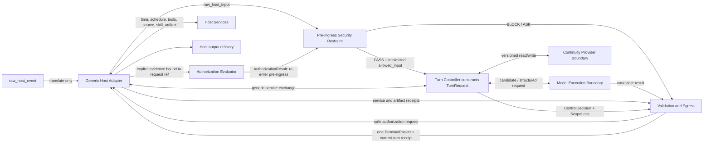

# Successor Component Graph

status: review
owner: docs/domains/runtime
last_reviewed: 2026-08-08
assignment: BC-018

## One-page graph

The arrows describe contracts, not live calls. Host services and continuity are
not implied available. Every used path requires a verified capability record;
side effects and durable writes require provider receipts.

The Host Adapter never constructs `TurnRequest`. The authorization loop does
not enter the Turn Controller: a safe pre-ingress `ASK` obtains explicit
evidence, Auth evaluates it, and `AuthorizationResult` returns to the Security
Restraint. Only `SecurityDecision PASS` permits Turn Controller normalization
and ordinary routing.

## Exclusive deterministic responsibilities

| Responsibility | Owner |
|---|---|
| OPSEC pre-ingress decision and input minimization | Pre-ingress Security Restraint |
| Authorization policy evaluation and session transition validation | Authorization Evaluator |
| `SecurityDecision PASS` + `allowed_input` normalization into `TurnRequest`; capability validation, route, owner, ScopeLock, service dispatch authorization | Turn Controller |
| Source policy, artifact/completion proof, terminal status, egress, receipt-backed diagnostics | Validation and Egress |

No responsibility appears twice. Construction and validation are distinct:
the Turn Controller constructs ScopeLock, while Validation and Egress checks the
candidate against it. That is not duplicate ownership.

## Exec decomposition

| Historical/current Exec responsibility | Successor owner | Disposition |
|---|---|---|
| pre-ingress security scheduling | Security Restraint is placed directly at the boundary | deterministic; recovered without scheduler ownership |
| pre-ingress Auth evaluation/state | Authorization Evaluator plus evidence-provider interface; result re-enters Security Restraint | hybrid; bounded contract; no ordinary routing |
| routing and arbitration | Turn Controller | deterministic |
| one-owner enforcement | Turn Controller | deterministic |
| ScopeLock construction | Turn Controller | deterministic |
| dependency allowlist and dispatch authorization | Turn Controller | deterministic |
| Persona-shaped ordinary execution | Model Execution Boundary | model-facing |
| Operations semantic anti-drift | Model Execution Boundary under current law | model-facing |
| source-policy and claim-result enforcement | Validation and Egress | hybrid policy with model-dependent semantic mapping |
| packet, capability, transition, and artifact validation | Validation and Egress | deterministic |
| final egress and receipt | Validation and Egress | deterministic |
| diagnostics | Validation and Egress receipt view | deterministic; no service |
| host tool execution, time, scheduling, delivery | Host services through adapter | host-owned |
| durable memory | Continuity provider | external |
| feature-specific workflows and mega-Exec accumulation | none | rejected |

There is no catch-all successor owner and no component named Exec.

## Component removal test

Removing any of the four deterministic components creates a concrete failure:
pre-ingress policy moves too late; authorization becomes conversational;
route/owner/scope lose a single control owner; or output becomes
self-certified. Removing a boundary component would falsely assign model,
platform, or durable-storage authority to the core.

No other historical component passes that test, so none is retained.
